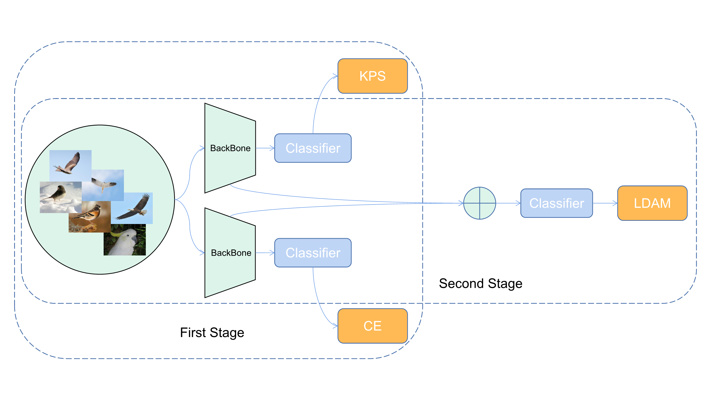
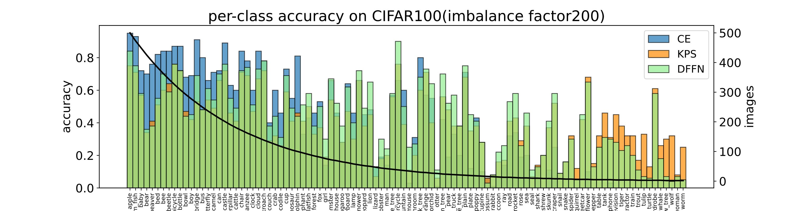

# DFFN:Differentiated Feature Fusion Network for Long-tailed Visual Recognition
**Authors**: XueSong Zhou, JunHai Zhai, Yang Cao

This is the [source code](https://github.com/zxsong999/Differentiated-Feature-Fusion-Network.pytorch) for our  paper: Differentiated Feature Fusion Network for Long-tailed Visual Recognition  

<div align="center">
  
</div><br/>

**Introduction**: In this paper, we proposed a novel two-stage feature fusion network. The feature learning module contains two structurally identical backbone networks trained with different loss functions: one feature network is trained biased toward the head classes and the other one is trained biased towards the tail classes. The classifier learning module fuses the features obtained from the feature learning module, and the classifier is fine-tuned to classify the input images. Unlike the previous methods, the proposed method adopts different loss functions for head and tail classes so that the classifier can achieve a balanced result between the head and tail. Experimental results show that the proposed method can significantly improve the classification accuracy of the tail classes without excessive loss of accuracy of the head classes.

<div align="center">
  
</div><br/>

**Requirements**

* Python 3.9
* torchvision 0.12.0
* Pytorch 1.11.0

**Dataset Preparation**
* [CIFAR-10 & CIFAR-100](https://www.cs.toronto.edu/~kriz/cifar.html)
* [ImageNet](http://image-net.org/index)

## Training

**Stage-1**:

To train a model for Stage-1 with *mixup*, run:

**CIFAR10 CE Loss**:
```bash
$ python cifar_train.py --arch resnet32 --dataset cifar10 --loss_type 'CE' --imb_factor 0.005 --batch_size 64 --learning_rate 0.1 
```

**CIFAR10 KPS Loss**:

```bash
$ python cifar_train.py --arch resnet32 --dataset cifar10 --loss_type 'KPS' --imb_factor 0.005 --batch_size 64 --learning_rate 0.1 
```

**CIFAR100 CE Loss**:
```bash
$ python cifar_train.py --arch resnet32 --dataset cifar100 --loss_type 'CE' --imb_factor 0.005 --batch_size 64 --learning_rate 0.1 
```

**CIFAR100 KPS Loss**:

```bash
$ python cifar_train.py --arch resnet32 --dataset cifar100  --loss_type 'KPS' --imb_factor 0.005 --batch_size 64 --learning_rate 0.1 
```

**ImageNet CE Loss**:
```bash
$ python ImageNet_train.py --arch resnet50 --root ImageNet_PATH --loss_type 'CE' --batch_size 64 --learning_rate 0.1 
```

**ImageNet KPS Loss**:

```bash
$ python ImageNet_train.py --arch resnet50 --root ImageNet_PATH --loss_type 'KPS'  --batch_size 64 --learning_rate 0.1 
```

**Stage-2**:

To train a Classifier for Stage-2, run:

**CIFAR10**:
```bash
$ python cifar_train_classifier.py --arch resnet32 --dataset 'cifar10'--loss_type 'LDAM' --imb_factor 0.005 --batch_size 64 --learning_rate 0.1  --lam 0.5  --resume_KPS 'Stage-1_KPS/ckpt.best.pth.tar' --resume_CE 'Stage-1_CE/ckpt.best.pth.tar'
```

**CIFAR100**:
```bash
$ python cifar_train_classifier.py --arch resnet32 --dataset 'cifar100' --loss_type 'LDAM' --imb_factor 0.005 --batch_size 64 --learning_rate 0.1  --lam 0.9  --resume_KPS 'Stage-1_KPS/ckpt.best.pth.tar' --resume_CE 'Stage-1_CE/ckpt.best.pth.tar'
```

**ImageNet**:
```bash
$ python imagenet_train_classifier.py --arch resnet50 --root ImageNet_PATH --loss_type 'LDAM' --batch_size 64 --learning_rate 0.1  --lam 0.9  --resume_KPS 'Stage-1_KPS/ckpt.best.pth.tar' --resume_CE 'Stage-1_CE/ckpt.best.pth.tar'
```


## Contact

If you have any questions about our work, feel free to contact us through email (XueSong Zhou: zxsonghbu@163.com) or Github issues.
